Analiza stylu życia studentów
================
Jan Kawalerski

- [Wstęp](#wstęp)
- [Wyjaśnienie zmiennej GPA](#wyjaśnienie-zmiennej-gpa)
- [Wykorzystane biblioteki](#wykorzystane-biblioteki)
- [Wczytanie danych i wstępna
  analiza](#wczytanie-danych-i-wstępna-analiza)
  - [Braki danych?](#braki-danych)
- [Rozkład zmiennych](#rozkład-zmiennych)
- [Podstawowe statystyki opisowe](#podstawowe-statystyki-opisowe)
- [Wyznaczenie korelacji](#wyznaczenie-korelacji)
  - [Ogólne wnioski](#ogólne-wnioski)
  - [Analiza korelacji stresu](#analiza-korelacji-stresu)
  - [Stres a GPA - wykres gęstości](#stres-a-gpa---wykres-gęstości)
  - [Jak na poziom stresu wpływa sen, a jak
    sport?](#jak-na-poziom-stresu-wpływa-sen-a-jak-sport)
  - [GPA, Stres i ilość nauki](#gpa-stres-i-ilość-nauki)
  - [Sport to zdrowie… i wyrzeczenia](#sport-to-zdrowie-i-wyrzeczenia)
  - [Testy statystyczne](#testy-statystyczne)
- [Wnioski](#wnioski)

## Wstęp

W ramach EDA na projekt zaliczeniowy zostanie wykonana analiza zestawu:
“Daily Lifestyle and Academic Performance of Students”, który zawiera
dane od 2000 studentów zebranych z ankiety Google Forms, dostępnego na
Kaggle. Dane obejmują rok akademicki sierpień 2023-maj 2024 i zostały
zebrane głównie od hinduskich studentów na amerykańskich uczelniach (z
pełnej gamy kierunków: od inżynieryjnych, przez związane z zarządzaniem
aż po artystyczne). Zawierają informacje o ilości czasu spędzonego na
naukę, zajęcia dodatkowe, sen, socializację i aktywność fizyczną.
Ponadto dostępna jest ocena GPA i określony przez samego studenta poziom
stresu. Głównym celem analizy będzie zbadanie jak wymienione zmienne
wpływają na poziom stresu i ocenę.

## Wyjaśnienie zmiennej GPA

Ocena GPA (Grade Point Avarage) to konwersja typowych amerykańskich ocen
(na skali F do A) na wartości liczbowe: od 0.0 pkt. za F i do 4.0 za A.
Z tychże wartości liczona jest nastepnie średnia. Tak zatem pod
skomplikowanym słownictwem i nietypową skalą, kryje się zwyczajnie znana
nam doskonale końcoworoczna średnia ocen.

## Wykorzystane biblioteki

dplyr, tidyverse, ggplot2, corrplot, psych

## Wczytanie danych i wstępna analiza

``` r
students<-read.csv('student_lifestyle_dataset.csv')
head(students,4)
```

    ##   Student_ID Study_Hours_Per_Day Extracurricular_Hours_Per_Day
    ## 1          1                 6.9                           3.8
    ## 2          2                 5.3                           3.5
    ## 3          3                 5.1                           3.9
    ## 4          4                 6.5                           2.1
    ##   Sleep_Hours_Per_Day Social_Hours_Per_Day Physical_Activity_Hours_Per_Day  GPA
    ## 1                 8.7                  2.8                             1.8 2.99
    ## 2                 8.0                  4.2                             3.0 2.75
    ## 3                 9.2                  1.2                             4.6 2.67
    ## 4                 7.2                  1.7                             6.5 2.88
    ##   Stress_Level
    ## 1     Moderate
    ## 2          Low
    ## 3          Low
    ## 4     Moderate

``` r
tail(students,4)
```

    ##      Student_ID Study_Hours_Per_Day Extracurricular_Hours_Per_Day
    ## 1997       1997                 6.3                           2.8
    ## 1998       1998                 6.2                           0.0
    ## 1999       1999                 8.1                           0.7
    ## 2000       2000                 9.0                           1.7
    ##      Sleep_Hours_Per_Day Social_Hours_Per_Day Physical_Activity_Hours_Per_Day
    ## 1997                 8.8                  1.5                             4.6
    ## 1998                 6.2                  0.8                            10.8
    ## 1999                 7.6                  3.5                             4.1
    ## 2000                 7.3                  3.1                             2.9
    ##       GPA Stress_Level
    ## 1997 2.65     Moderate
    ## 1998 3.14     Moderate
    ## 1999 3.04         High
    ## 2000 3.58         High

``` r
str(students)
```

    ## 'data.frame':    2000 obs. of  8 variables:
    ##  $ Student_ID                     : int  1 2 3 4 5 6 7 8 9 10 ...
    ##  $ Study_Hours_Per_Day            : num  6.9 5.3 5.1 6.5 8.1 6 8 8.4 5.2 7.7 ...
    ##  $ Extracurricular_Hours_Per_Day  : num  3.8 3.5 3.9 2.1 0.6 2.1 0.7 1.8 3.6 0.7 ...
    ##  $ Sleep_Hours_Per_Day            : num  8.7 8 9.2 7.2 6.5 8 5.3 5.6 6.3 9.8 ...
    ##  $ Social_Hours_Per_Day           : num  2.8 4.2 1.2 1.7 2.2 0.3 5.7 3 4 4.5 ...
    ##  $ Physical_Activity_Hours_Per_Day: num  1.8 3 4.6 6.5 6.6 7.6 4.3 5.2 4.9 1.3 ...
    ##  $ GPA                            : num  2.99 2.75 2.67 2.88 3.51 2.85 3.08 3.2 2.82 2.76 ...
    ##  $ Stress_Level                   : chr  "Moderate" "Low" "Low" "Moderate" ...

Wszystko narazie zdaje się być w porządku, mamy do czynienia głównie ze
zmiennymi numerycznymi. Wartałoby jednak typ cechy Stress_Level zmienić
na factor.

``` r
students$Stress_Level<-factor(students$Stress_Level,levels=c("Low","Moderate","High"))
```

### Braki danych?

``` r
sapply(students,anyNA)
```

    ##                      Student_ID             Study_Hours_Per_Day 
    ##                           FALSE                           FALSE 
    ##   Extracurricular_Hours_Per_Day             Sleep_Hours_Per_Day 
    ##                           FALSE                           FALSE 
    ##            Social_Hours_Per_Day Physical_Activity_Hours_Per_Day 
    ##                           FALSE                           FALSE 
    ##                             GPA                    Stress_Level 
    ##                           FALSE                           FALSE

Wspaniałe wieści. Braków danych - brak.

## Rozkład zmiennych

Ze względu na sam charakter danych nie powinno w nim być wartości
odstających (ankieta dawała możliwość wyboru godzin z określonego
zakresu). Mimo wszystko jednak warto się upewnić i poznać rozkład
badanych cech.

``` r
students %>%
  ggplot() +
  geom_histogram(aes(x = Study_Hours_Per_Day),bins=7,color="darkolivegreen",fill="darkolivegreen4")+
theme_bw()+theme(text=element_text(size=16))+
  labs(title = "Godziny nauki dziennie",
       x = "Godziny",
       y = "Liczba studentów")
```

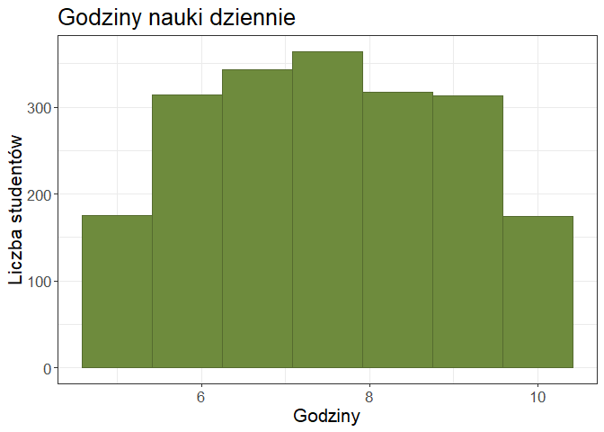<!-- -->

Wygląda na spłaszczony rozkład normalny. W każdym razie badani studenci
uczą się od 5-10h (wliczono zajęcia na uczelni). Niesie to ze sobą
wiadomość dobrą i złą. Dobra jest taka, że nie ma wartości odstających,
zła zaś, że nasi koledzy w USA są przepracowani.

``` r
students %>%
  ggplot() +
  geom_histogram(aes(x = Sleep_Hours_Per_Day),bins=7,color="darkolivegreen",fill="darkolivegreen4")+
theme_bw()+theme(text=element_text(size=16))+
  labs(title = "Godziny snu dziennie",
       x = "Godziny",
       y = "Liczba studentów")
```

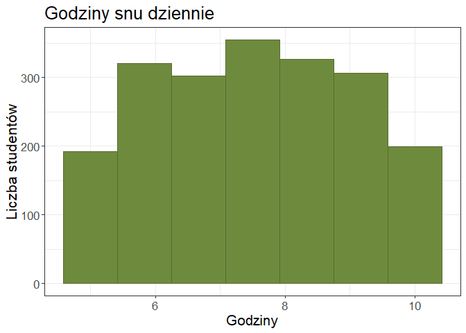<!-- -->

Rozkład jak dla ocen, co ciekawe niektórzy śpią nawet średnio 10h
dziennie.

``` r
students %>%
  ggplot() +
  geom_histogram(aes(x = Extracurricular_Hours_Per_Day),bins=7,color="darkolivegreen",fill="darkolivegreen4")+
theme_bw()+theme(text=element_text(size=16))+
  labs(title = "Zajęcia pozalekcyjne dziennie",
       x = "Godziny",
       y = "Liczba studentów")
```

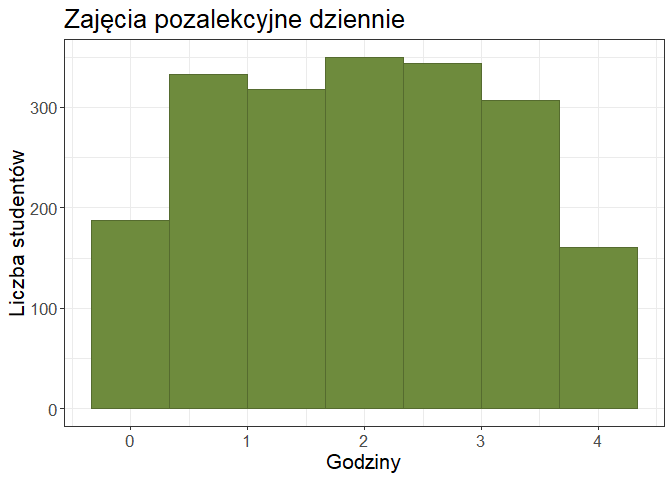<!-- -->

Podobna sytuacja, nie wypada nie być członkiem koła naukowego, choć są
oczywiście studenci, którzy nie rozwijają się poza uczelnią.

``` r
students %>%
  ggplot() +
  geom_histogram(aes(x = Social_Hours_Per_Day),bins=7,color="darkolivegreen",fill="darkolivegreen4")+
theme_bw()+theme(text=element_text(size=16))+
  labs(title = "Godziny spędzone z przyjaciółmi dziennie",
       x = "Godziny",
       y = "Liczba studentów")
```

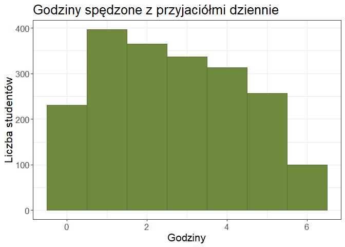<!-- -->

Wygląda to pocieszająco, osoby nie spędzające w ogóle czasu na
socjalizacji odstają od reszty (pociesza, że odstają statystycznie, a
nie społecznie)

``` r
students %>%
  ggplot() +
  geom_histogram(aes(x = Physical_Activity_Hours_Per_Day),bins=7,color="darkolivegreen",fill="darkolivegreen4")+
theme_bw()+theme(text=element_text(size=16))+
  labs(title = "Godziny sportu dziennie",
       x = "Godziny",
       y = "Liczba studentów")
```

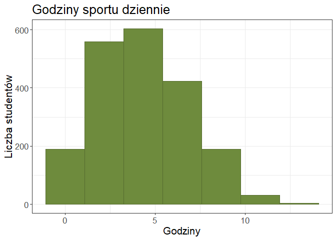<!-- -->

Rozkład lewostronnie skośny i specyfika amerykańskich collegów: duży
nacisk na sport. Sprawdzam jeszcze jak wygląda tu wykres pudełkowy.

``` r
students %>%
  ggplot() +
  geom_boxplot(aes(x = Physical_Activity_Hours_Per_Day),color="darkolivegreen",fill="darkolivegreen4")+
theme_bw()+theme(text=element_text(size=16))+
  labs(title = "Godziny sportu dziennie",
       x = "Godziny",
       y = "Liczba studentów")
```

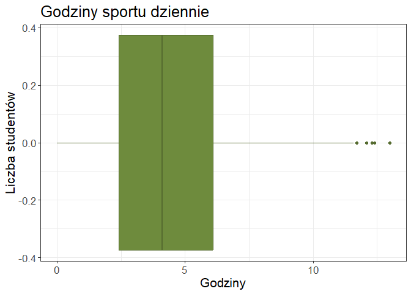<!-- -->

Boxplot pokazuje, że wyniki dla sportu są prawdopodobnie częsciowo
błędne - byćmoże aniketerzy nie doczytali i pomyśleli, że chodzi o ilość
godzin sportu tygodniowo? Skorzystam z winsoryzacji i w celu zachowania
rzetelności wyniki powyżej 10h zastąpie 5h, które zdają się być bardziej
prawdopodobne.

``` r
students <- students %>%
  mutate(Physical_Activity_Hours_Per_Day = ifelse(Physical_Activity_Hours_Per_Day > 10, 
                                                  5, 
                                                  Physical_Activity_Hours_Per_Day))
```

``` r
students %>%
  ggplot() +
  geom_histogram(aes(x = GPA),bins=8,color="firebrick4",fill="firebrick",alpha=0.7) +theme_bw()+
  theme(text=element_text(size=16))+
  labs(title = "Ocena GPA",
       x = "Ocena",
       y = "Liczba studentów")
```

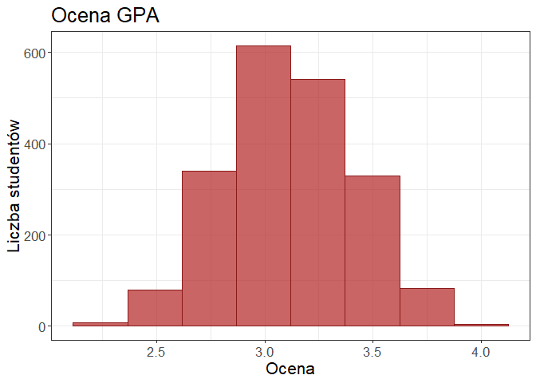<!-- -->

W przypadku GPA zyskujemy typowy rozkład normalny, z zauważalną
lewostronną asymetrią.

``` r
students%>%
  ggplot() +
  geom_bar(aes(x = Stress_Level),color="rosybrown4",fill="rosybrown") +theme_bw()+
    theme(text=element_text(size=16))+
  labs(title = "Poziom stresu",
       x = "Stopień poziomu stresu",
       y = "Liczba studentów")
```

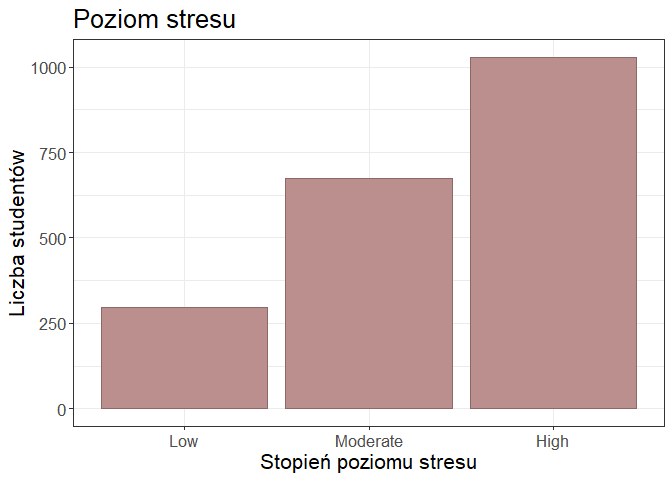<!-- -->

Wraz z poziomem stresu wzrasta liczba studentów, która u siebie go
zauważa.

## Podstawowe statystyki opisowe

Sama analiza wizualna to za mało. Zanim przejdę dalej, warto zbadać
podstawowe statystyki opisowe dla zmiennych.

``` r
describe(students,skew=TRUE)
```

    ##                                 vars    n    mean     sd  median trimmed    mad
    ## Student_ID                         1 2000 1000.50 577.49 1000.50 1000.50 741.30
    ## Study_Hours_Per_Day                2 2000    7.48   1.42    7.40    7.47   1.78
    ## Extracurricular_Hours_Per_Day      3 2000    1.99   1.16    2.00    1.99   1.48
    ## Sleep_Hours_Per_Day                4 2000    7.50   1.46    7.50    7.50   1.93
    ## Social_Hours_Per_Day               5 2000    2.70   1.69    2.60    2.66   2.08
    ## Physical_Activity_Hours_Per_Day    6 2000    4.25   2.40    4.10    4.17   2.67
    ## GPA                                7 2000    3.12   0.30    3.11    3.11   0.31
    ## Stress_Level*                      8 2000    2.37   0.73    3.00    2.46   0.00
    ##                                  min  max   range  skew kurtosis    se
    ## Student_ID                      1.00 2000 1999.00  0.00    -1.20 12.91
    ## Study_Hours_Per_Day             5.00   10    5.00  0.03    -1.18  0.03
    ## Extracurricular_Hours_Per_Day   0.00    4    4.00  0.00    -1.18  0.03
    ## Sleep_Hours_Per_Day             5.00   10    5.00 -0.01    -1.21  0.03
    ## Social_Hours_Per_Day            0.00    6    6.00  0.18    -1.12  0.04
    ## Physical_Activity_Hours_Per_Day 0.00   10   10.00  0.27    -0.72  0.05
    ## GPA                             2.24    4    1.76  0.03    -0.38  0.01
    ## Stress_Level*                   1.00    3    2.00 -0.69    -0.84  0.02

Z ciekawszych wniosków: sporą wariancją odznacza się ilość uprawianego
sportu, w odróżnieniu od np. GPA, gdzie nie ma już takich różnic.
Mediana 3 dla poziomu stresu jest alarmująca: przeciętny student jest
wysoce zestresowany.

## Wyznaczenie korelacji

Po zbadaniu rozkładów cech przychodzi czas na określenie korelacji
między danymi zmiennymi. Wykorzystam korelację Pearsona bo zmienne
generalnie mają rozkłady zbliżone do normalnego.

``` r
stud_cor<-students
stud_cor$Stress_Level<-as.numeric(stud_cor$Stress_Level)
napisy<-c("Nauka","Sen","Znajomi","Sport","GPA","Stres")
cor = cor(stud_cor[,c("Study_Hours_Per_Day", "Sleep_Hours_Per_Day", "Social_Hours_Per_Day","Physical_Activity_Hours_Per_Day","GPA","Stress_Level")], 
          method = "pearson")
colnames(cor)<-napisy
rownames(cor)<-napisy
round(cor, 2)
```

    ##         Nauka   Sen Znajomi Sport   GPA Stres
    ## Nauka    1.00  0.03   -0.14 -0.47  0.73  0.74
    ## Sen      0.03  1.00   -0.19 -0.46  0.00 -0.30
    ## Znajomi -0.14 -0.19    1.00 -0.40 -0.09 -0.05
    ## Sport   -0.47 -0.46   -0.40  1.00 -0.33 -0.21
    ## GPA      0.73  0.00   -0.09 -0.33  1.00  0.55
    ## Stres    0.74 -0.30   -0.05 -0.21  0.55  1.00

``` r
corrplot(cor,method="square",type="upper")
```

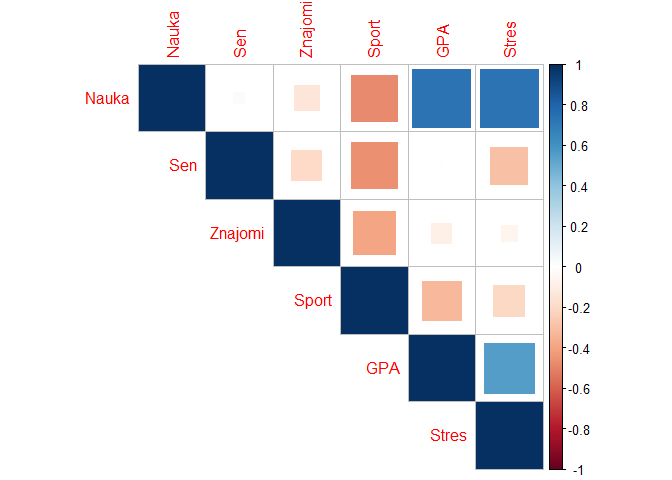<!-- -->

### Ogólne wnioski

Macierz korelacji podrzuca całą garść ciekawych wniosków. Zacznijmy od
oczywistych. Bardzo silna dodania korelacja między nauką a GPA, nie
dziwi. Okazuje się, że naukę da się połączyć ze spaniem i czasem z
przyjaciółmi, korelacje raczej niewielkie. Sport jednak, wymaga
ewidentnie wyrzeczeń - ma całkiem mocną ujemną korelację z wymienionymi
wcześniej trzema formami spędzania czasu.

### Analiza korelacji stresu

Co zaś ze stresem? Niezwykle silna dodatnia korelacja między poziomem
stresu a oceną GPA i ilością nauki zdaje się nie być niczym odkrywczym.
Co ciekawe jednak, to zdrowy sen, a nie aktywny tryb życia wpływa
bardziej na poziom stresu. Czas spędzony ze znajomymi jest raczej
nieskorelowany. Zbadajmy dodatkowo związek między poziomem stresu, a
oceną GPA korzystając z wykresu gęstości.

### Stres a GPA - wykres gęstości

``` r
students %>%
  ggplot() +
  geom_density(aes(x = GPA, fill = Stress_Level),alpha=0.8) +scale_fill_manual(values = c(
    "Low" = "SeaGreen",      
    "Moderate" = "Gold", 
    "High" = "IndianRed"      
  )) +
  theme_bw()+
  theme(text=element_text(size=16))+
  labs(title = "Rozkład GPA w podziale na kategorie poziomu stresu",
       x = "GPA",
       y = "Gęstość prawdopodobieństwa",
       fill = "Poziom stresu")
```

<!-- -->

#### Opis

Widać wyraźne, sekwencyjne przesunięcie rozkładów wzdłuż osi X, co
potwierdza wcześniejsze wnioski o korelacji, ale dodaje do tej
obserwacji kontekst.

#### Niski poziom stresu

Rozkład jest przesunięty najmocniej w lewo. Dominanta przypada na
wartości GPA w okolicach 2.8 – 2.9. Krzywa ta szybko opada przy wyższych
wynikach, co wskazuje, że osiągnięcie bardzo wysokiego GPA (powyżej 3.5)
przy zachowaniu niskiego poziomu stresu jest w badanej populacji
zjawiskiem rzadkim.

#### Średni poziom

Stanowi grupę pośrednią ze szczytem w okolicach GPA 3.0 – 3.1. Rozkład
jest symetryczny względem pozostałych grup, co sugeruje naturalną wzrost
kosztów psychicznych wraz ze podnoszeniem się wymagań akademickich.

#### Wysoki stres

Rozkład jest wyraźnie przesunięty w prawą stronę, z dominantą w
okolicach GPA 3.3 – 3.4. Co istotne, “lewy ogon” tego rozkładu jest
krótki – oznacza to, że w grupie studentów o wysokim stresie stosunkowo
rzadko spotyka się osoby z niskimi wynikami. Zdecydowana większość tej
grupy to studenci osiągający wyniki powyżej średniej.

#### Ostateczne wnioski

Wraz ze wzrostem wyników w nauce, punkt ciężkości populacji przesuwa się
w stronę wyższych kategorii stresu. Nakładanie się wykresów (obszary
wspólne) wskazuje jednak, że stres nie jest jedynym determinantem oceny.

### Jak na poziom stresu wpływa sen, a jak sport?

Rozbudujmy analizę ciekawej zależności - stary dobry sen może zdziałać
dla zdrowia psychicznego więcej niż sport. Wykorzystam pivot_longer() -
następcę funkcji gather() - do sprowadzenia do postaci wąskiej.
facet_wrap() sprawia, że są rysowane osobne wykresy dla każdej wartości
z kolumny Aktywnosc.

``` r
df_long <- students %>%
  select(Stress_Level, Sleep_Hours_Per_Day, Physical_Activity_Hours_Per_Day) %>%
  pivot_longer(cols = c(Sleep_Hours_Per_Day, Physical_Activity_Hours_Per_Day), 
               names_to = "Aktywnosc", 
               values_to = "Godziny")

ggplot(df_long, aes(x = Stress_Level, y = Godziny, fill = Stress_Level)) +
  geom_boxplot(alpha = 0.7) + 
  facet_wrap(~Aktywnosc, scales = "free_y", labeller = as_labeller(c(
             "Physical_Activity_Hours_Per_Day" = "Aktywność fizyczna",
             "Sleep_Hours_Per_Day" = "Sen"
           ))) +     
  scale_fill_manual(values = c("SeaGreen", "Gold", "IndianRed")) +
  labs(title = "Porównanie wpływu Snu i Sportu na poziom stresu",
       subtitle = "Silniejsza korelacja widoczna w wyraźniejszym trendzie dla Snu",
       x = "Poziom Stresu",
       y = "Liczba godzin") +
  theme_bw()
```

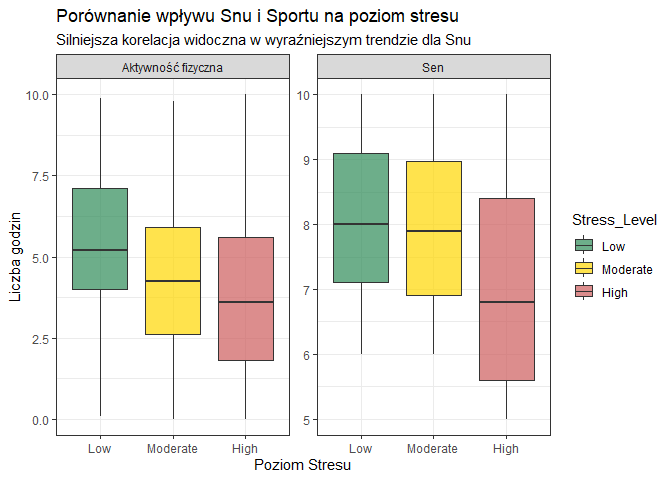<!-- -->

W przypadku snu, obserwujemy silną korelację ujemną. Studenci o niskim
poziomie stresu utrzymują medianę snu na poziomie zalecanych 8 godzin. W
grupie o wysokim stresie, mediana spada poniżej 7 godzin, a cały rozkład
przesuwa się w dół.

W przypadku aktywności fizycznej, trend nie jest jednoznaczny. Poziom
sportu jest zbliżony we wszystkich grupach (mediany na podobnym
poziomie). Wskazuje to, że w badanej populacji ilość sportu nie
różnicuje poziomu stresu tak silnie jak ilość snu. Co ciekawe w grupie
wysokiego stresu jest kilka wartości odstających - byćmoże owi studenci
uciekają w sport by się nie stresować, lub też sam sport jest dla nich
stresujący.

Wyjątkowo ciekawe wnioski, wiedzaiłem, że niepotrzebnie kupiłem karnet
na siłownie, trzeba było spać więcej. Wchodze w sprawę głębiej: zbadajmy
violin plot i boxplot dla zjawiska zależności sportu od stresu.

``` r
students %>%
  ggplot(aes(x = Stress_Level, y = Physical_Activity_Hours_Per_Day)) +
  geom_violin(color = "darkolivegreen", fill = "darkolivegreen4", trim = TRUE, alpha = 0.6) +
  geom_boxplot(width = 0.1, color = "black", alpha = 0.5, outlier.shape = NA) +
  theme_bw() + 
  theme(text = element_text(size = 16)) +
  labs(title = "Godziny sportu dziennie a poziom stresu",
       x = "Poziom stresu",      
       y = "Godziny")            
```

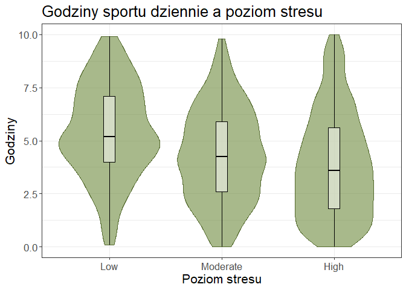<!-- -->

Aktywność fizyczna nie wykazuje większych różnic między grupami poziomu
stresu. Rozkłady są zbliżone we wszystkich trzech kategoriach, co
sugeruje, że ilość uprawianego sportu nie jest głównym czynnikiem
różnicującym poziom stresu w badanej próbie

### GPA, Stres i ilość nauki

Wiemy już, że te trzy są ze sobą silnie skorelowane. Czego ciekawego
możemy się dowiedzieć gdy umieścimy je na jednym wykresie?

``` r
students %>%
  ggplot() +
  geom_point(aes(x = GPA, y = Study_Hours_Per_Day, color = Stress_Level),
             alpha = 0.6, size=2) + 
  theme_bw() +
  scale_color_manual(values = c("SeaGreen", "Gold3", "IndianRed"))+
  labs(title = "Stres w zależności od nauki i oceny",
       x = "Ocena",
       y = "Czas na naukę")
```

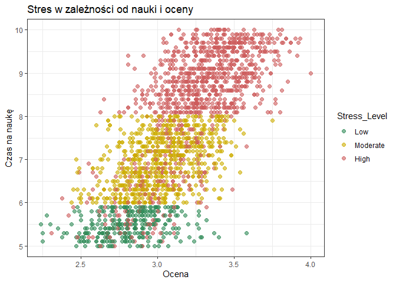<!-- -->

#### Wstępna analiza

Silna korelacja między czasem na naukę a GPA, osiągnięcie najwyższych
wyników (\>3.5) wymaga nakładów pracy powyżej 8h dziennie co
automatycznie skutkuje dużym stresem.

Najciekawsze są chyba jednak arbitralne linie, dla 6h i 8h wyznaczające
idealne granice średniego poziomu stresu. Czy zatem poziom stresu jest
tu wyłącznie nakładką na godziny nauki, a poziom wysokiego stresu został
losowo powrzucany?

``` r
cor(students$Study_Hours_Per_Day,as.numeric(students$Stress_Level))
```

    ## [1] 0.7388432

Korelacja, choć bardzo silna, nie wynosi 1. Po drugie widzimy, Autor
zbioru danych (Sumit Kumar) identyfikuje źródło takiej struktury jako
efekt dwóch czynników:

1.  Psychologiczne progowanie (Mental Thresholds): Respondenci mają
    tendencję do kategoryzowania samych siebie w oparciu o uproszczone
    heurystyki.

2.  Artefakty dyskretyzacji: Dane zostały poddane procesowi binningu
    (grupowania).

Mimo wszystko jednak będe miał to na uwadze i zachowam ostrożność.

#### Dalsze wnioski

Analiza wykresu punktowego ujawnia istotną asymetrię. Podczas gdy
ekstremalnie duży nakład czasu na naukę (\>8h) wydaje się być warunkiem
wystarczającym do wystąpienia wysokiego stresu (brak punktów ‘Low
Stress’ w górnej partii wykresu), o tyle mały nakład pracy nie
gwarantuje komfortu psychicznego. W dolnym zakresie osi Y obserwujemy
studentów z każdej grupy stresowej. Oznacza to, że można być mocno
zestresowanym, ucząc się niewiele (np. z powodu prokrastynacji, obawy
przed porażką czy czynników zewnętrznych)

#### Regresja liniowa

Warto wzbogacić te rozważania o prosty model regresji liniowej badający
zależność między nauką a GPA.

``` r
model <- lm(GPA ~ Study_Hours_Per_Day, data = students)
summary(model)
```

    ## 
    ## Call:
    ## lm(formula = GPA ~ Study_Hours_Per_Day, data = students)
    ## 
    ## Residuals:
    ##      Min       1Q   Median       3Q      Max 
    ## -0.60834 -0.13516 -0.00103  0.13606  0.79925 
    ## 
    ## Coefficients:
    ##                     Estimate Std. Error t value Pr(>|t|)    
    ## (Intercept)         1.964228   0.024236   81.05   <2e-16 ***
    ## Study_Hours_Per_Day 0.154061   0.003185   48.38   <2e-16 ***
    ## ---
    ## Signif. codes:  0 '***' 0.001 '**' 0.01 '*' 0.05 '.' 0.1 ' ' 1
    ## 
    ## Residual standard error: 0.2027 on 1998 degrees of freedom
    ## Multiple R-squared:  0.5394, Adjusted R-squared:  0.5392 
    ## F-statistic:  2340 on 1 and 1998 DF,  p-value: < 2.2e-16

R2 wynosi 0.53, czas poświęcony na naukę wyjaśnia zatem 53% zmienności
ocen GPA. W regresji liniowej test F sprawdza hipotezę: “Czy ten model
jako całość wyjaśnia cokolwiek lepiej niż sama średnia?”. Model jest
statystycznie bardzo istotny (F=2340, p\<0,001). Wynika z niego, że
teoretyczne GPA studenta, który uczy się 0h wynosi 1,96. Oznacza to, że
student nieuczący się w ogóle balansuje na granicy wyrzucenia ze studiów
(2.0 to w USA typowa granica zaliczenia).

### Sport to zdrowie… i wyrzeczenia

Chciałbym wrócić do ciekawej obserwacji z macierzy korelacji - wynikało
z niej, że trudno łączyć sport z innymi formami spędzania czasu, w
każdym razie trudniej niż np. naukę i czas z przyjaciółmi.

``` r
df_trends <- students %>%
  group_by(Physical_Activity_Hours_Per_Day) %>%
  summarise(
    Sleep = mean(Sleep_Hours_Per_Day),
    Study = mean(Study_Hours_Per_Day),
    Social = mean(Social_Hours_Per_Day) 
  ) %>%
  pivot_longer(cols = c(Sleep, Study, Social), 
               names_to = "Activity", 
               values_to = "Avg_hours")
ggplot(df_trends, aes(x = Physical_Activity_Hours_Per_Day, y = Avg_hours, color = Activity)) +
  geom_line(size = 1.5, alpha = 0.8) +
  geom_point(size = 3) +
  scale_color_manual(values = c("Sleep" = "dodgerblue4", "Study" = "seagreen4", "Social" = "darkorange3")) +
  labs(title = "Sport and other activities",
       subtitle = "Avg Hours per activity depending on how much sport you do",
       x = "Sport hours daily",
       y = "Avg hours",
       color = "Activity") +
  theme_minimal() +
  theme(
    text = element_text(size = 14),
    panel.grid.minor = element_blank() # Usuwam grida dla czystości
  )
```

    ## Warning: Using `size` aesthetic for lines was deprecated in ggplot2 3.4.0.
    ## ℹ Please use `linewidth` instead.
    ## This warning is displayed once every 8 hours.
    ## Call `lifecycle::last_lifecycle_warnings()` to see where this warning was
    ## generated.

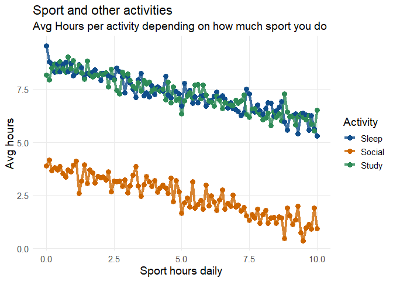<!-- -->

Wykres liniowy ujawnia niestety ostatecznie syntetyczną naturę zbioru
danych. Widać nienaturalną synchronizację zygzaków pomiędzy niezależnymi
zmiennymi (Sen, Nauka, Przyjaciele) i identyczne trendy.

### Testy statystyczne

Mimo to, by dopełnić projekt przeprowadzę jeszcze testy statystyczne.

#### Istotność różnicy średniej długości snu

H0: średnia długość snu w grupie “Sportowców” nie różni się istotnie od
grupy “Niesportowej” H1: średnie różnią się dla owych grup

``` r
mediana_sportu <- median(students$Physical_Activity_Hours_Per_Day)

students <- students %>%
  mutate(Grupa_Sportowa = ifelse(Physical_Activity_Hours_Per_Day > mediana_sportu, 
                                 "Dużo Sportu", "Mało Sportu"))

test_t <- t.test(Sleep_Hours_Per_Day ~ Grupa_Sportowa, data = students)

print(test_t)
```

    ## 
    ##  Welch Two Sample t-test
    ## 
    ## data:  Sleep_Hours_Per_Day by Grupa_Sportowa
    ## t = -17.881, df = 1997.8, p-value < 2.2e-16
    ## alternative hypothesis: true difference in means between group Dużo Sportu and group Mało Sportu is not equal to 0
    ## 95 percent confidence interval:
    ##  -1.2039597 -0.9659711
    ## sample estimates:
    ## mean in group Dużo Sportu mean in group Mało Sportu 
    ##                  6.953885                  8.038850

Test t-Studenta wykazał istotne różnice w średniej długości snu.
Studenci z grupy o wysokiej aktywności fizycznej śpią średnio o godzinę
krócej niż studenci mało aktywni. Potwierdza to hipotezę, że czas na
sport jest ‘kradziony’ z czasu na regenerację. Test potwierdza również
hipotezę o sztuczności danych: p-value jest ekstremalnie małe.

#### Test Chi-2 niezależności

Czy bycie sportowcem statystycznie wyklucza bycie śpiochem?

H0 - brak zależności między poziomem sportu, a snu H1 - występuje taka
zależność

``` r
mediana_snu <- median(students$Sleep_Hours_Per_Day)
students<-students%>%mutate(Grupa_Snu=ifelse(Sleep_Hours_Per_Day>mediana_snu,'Dużo snu','Mało snu'))

tabela <- table(students$Grupa_Sportowa, students$Grupa_Snu)
print(tabela)
```

    ##              
    ##               Dużo snu Mało snu
    ##   Dużo Sportu      331      660
    ##   Mało Sportu      667      342

``` r
test_chi <- chisq.test(tabela)
print(test_chi)
```

    ## 
    ##  Pearson's Chi-squared test with Yates' continuity correction
    ## 
    ## data:  tabela
    ## X-squared = 212.59, df = 1, p-value < 2.2e-16

Widoczna wyraźna inwersja proporcji, różnice znów są bardzo wysoce
istotne statystycznie. Odrzucam hipotezę zerową o niezależności
zmiennych. Wynik ten dowodzi, że w badanej próbie wysokie zaangażowanie
w sport silnie redukuje czasu snu.

## Wnioski

Zbiór prawie na pewno jest syntetyczny, co wynika z ekstremalnie niskich
p-value, nakładce Stresu na ilość nauki, dziwnych ilościach sportu,
identycznych trendach ilości nauki i snu w zalezności od sportu. Mimo to
jednak, gdyby założyć prawdziwość zbioru, można wyciągnąć z analizy
kilka ciekawych wniosków.

1.  Sport to nie-zdrowie: wymaga wyrzeczeń w postaci mniejszej ilości
    snu i czasu ze znajomymi, w niektórych przypadkach powoduje silny
    stres, w każdym razie raczej go nie obniża. Ze zbioru wynika, że
    lepiej więcej spać niż uprawiać sport - lub też raczej trzeba spać:
    brak snu niezwykle podnosi poziom stresu.

2.  Per aspera ad astra: większa ilość nauki to prawie zawsze wyższa
    ocena GPA, brak nauki oznacza balans na granicy wyrzucenia ze
    studiów.

3.  Wielkość boli: im wyższa ocena GPA i więcej nauki tym więcej stresu.
